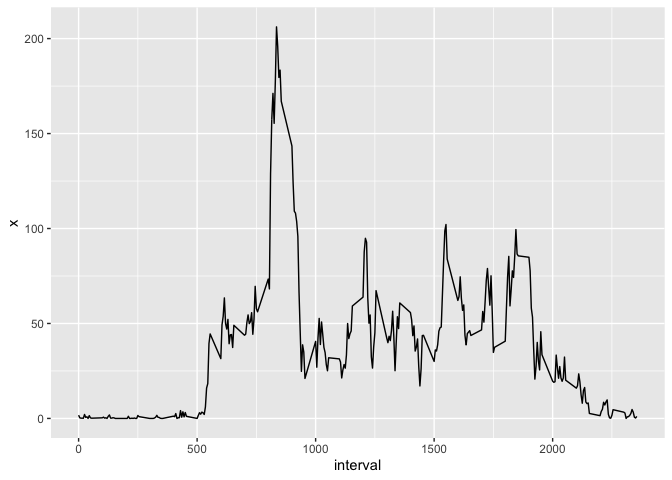

```r
library("ggplot2")
```
## Loading and preprocessing the data

```r
loaded_data<-read.csv("activity.csv")
```


## What is mean total number of steps taken per day?

```r
totals_per_day<-aggregate(loaded_data$steps, list(Day=loaded_data$date), sum)
mean_per_day<-aggregate(loaded_data$steps, list(Day=loaded_data$date), mean)
```
## Mean and median number of steps taken each day

```r
hist(totals_per_day$x)
```

<!-- -->

```r
summary(totals_per_day)
```

```
##      Day                  x        
##  Length:61          Min.   :   41  
##  Class :character   1st Qu.: 8841  
##  Mode  :character   Median :10765  
##                     Mean   :10766  
##                     3rd Qu.:13294  
##                     Max.   :21194  
##                     NA's   :8
```
## What is the average daily activity pattern?

```r
avg_per_interval<-aggregate(loaded_data$steps, list(interval=loaded_data$interval), mean, na.rm=TRUE)
ggplot(avg_per_interval, aes(x=interval,y=x))+geom_line()
```

<!-- -->

### Finding the Max interval

```r
max_interval_X<-subset(avg_per_interval,x==max(avg_per_interval$x))$interval
max_interval_Y<-subset(avg_per_interval,x==max(avg_per_interval$x))$x

ggplot(avg_per_interval, aes(x=interval,y=x))+geom_line()+geom_vline(xintercept = max_interval_X,colour="red")+geom_text(aes(x=max_interval_X, label="Max interval", y=max_interval_Y), colour="red", hjust = -.1)
```

<!-- -->

The max average interval is 835 and the max number steps is 206.1698113


## Imputing missing values

```r
numberOfMissingValues<-sum(is.na (loaded_data$steps))
```

The number of missing values is: 2304

Replacing the missing data by the average of taken from similar intervals and 
stroring that in a new data frame:

```r
fixed_data <- loaded_data

for (row in 1:nrow(loaded_data)) 
{ 
        if(is.na(loaded_data[row,]$steps)) 
        { 
                fixed_data[row,]$steps = subset(avg_per_interval,interval == loaded_data[row,]$interval)$x }}
```


## Histogram of the total number of steps taken each day after missing values are imputed

```r
totals_per_day_imputed<-aggregate(fixed_data$steps, list(Day=fixed_data$date), sum)
mean_per_day_imputed<-aggregate(fixed_data$steps, list(Day=fixed_data$date), mean)

hist(totals_per_day_imputed$x)
```

<!-- -->

```r
summary(totals_per_day_imputed)
```

```
##      Day                  x        
##  Length:61          Min.   :   41  
##  Class :character   1st Qu.: 9819  
##  Mode  :character   Median :10766  
##                     Mean   :10766  
##                     3rd Qu.:12811  
##                     Max.   :21194
```


## Are there differences in activity patterns between weekdays and weekends?

```r
fixed_data$daytype<- weekdays(as.Date(fixed_data$date))
fixed_data$daytype[fixed_data$daytype %in% c('Saturday', 'Sunday')] <- "weekend"
fixed_data$daytype[fixed_data$daytype != "weekend"] <- "weekday"

fixed_data$daytype<-as.factor(fixed_data$daytype)

avg_fixed_data <- aggregate(steps ~ interval + daytype ,fixed_data,mean)


ggplot(avg_fixed_data, aes(x=interval , y= steps)) + geom_line() + facet_grid(daytype~.)
```

<!-- -->


